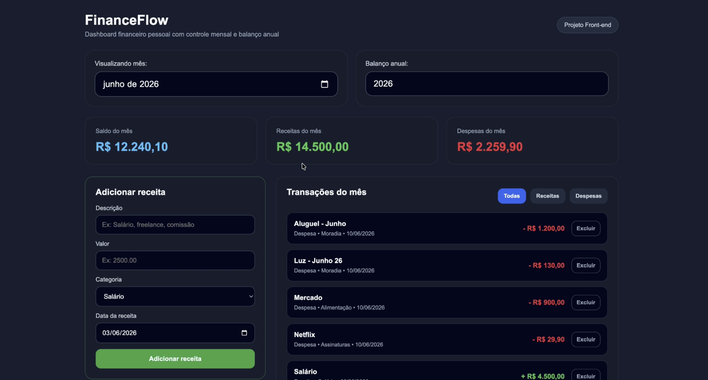

# FinanceFlow

Aplicação web para organização e visualização de finanças pessoais.

## Tecnologias utilizadas

- HTML
- CSS
- JavaScript

## Objetivo

Este projeto foi criado para praticar desenvolvimento web e versionamento com Git e GitHub.

## Como visualizar

Acesse o projeto online:

https://isacsabino.github.io/financeflow/

Ou abra o arquivo index.html no navegador.
